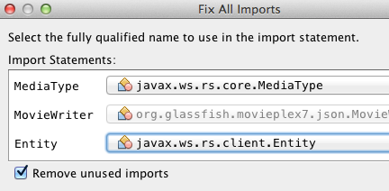
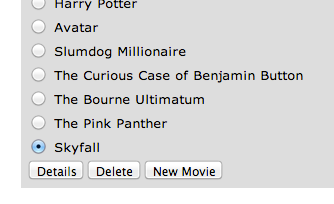

== Add Movie (Java API for JSON Processing)

*Purpose*: Add a new movie. In doing so several new features of the Java
API for JSON Processing 1.0 will be introduced and demonstrated by using
them in the application.

*Estimated Time*: 30-45 mins

Java API for JSON Processing provides a standard API to parse and
generate JSON so that the applications can rely upon a portable API.
This API will provide:

* Produce/Consume JSON in a streaming fashion (similar to StAX API for
XML)
* Build a Java Object Model for JSON (similar to DOM API for XML)

This section will define a JAX-RS Entity Providers that will allow
reading and writing JSON for a Movie POJO. The JAX-RS Client API will
request this JSON representation.

JAX-RS Entity Providers supply mapping services between on-the-wire
representations and their associated Java types.  Several standard Java
types such as String, byte[], javax.xml.bind.JAXBElement,
java.io.InputStream, java.io.File, and others have a pre-defined mapping
and is required by the specification. Applications may provide their own
mapping to custom types using MessageBodyReader and MessageBodyWriter
interfaces.

This section will provide the ability to add a new movie to the
application. Typically, this functionality will be available after
proper authentication and authorization.

*7.1* Right-click on Source Packages, select “New”, “Java Package…”,
specify the value as “org.glassfish.movieplex7.json”, and click on
“Finish”.

*7.2* Right-click on newly created package, select “New”, “Java Class…”,
specify the name as “MovieReader”, and click on “Finish”. Add the
following class-level annotations:

@Provider

@Consumes(MediaType.APPLICATION_JSON)

@Provider allows this implementation to be discovered by the JAX-RS
runtime during the provider scanning phase. @Consumes indicates that
this implementation will consume a JSON representation of the resource.

Make sure to resolve imports from the appropriate package as shown.

image:images/7.2-imports.png[image]

*7.3* Make the class implements MessageBodyReader<Movie>.

image:images/7.3-implements.png[image]

Click on the hint (shown as yellow bulb) on the class definition and
select “Implement all abstract methods”.

*7.4* Change implementation of the isReadable method as:

return Movie.class.isAssignableFrom(type);

This method ascertains if the MessageBodyReader can produce an instance
of a particular type.

*7.5* Replace the readFrom method to:

@Override

public Movie readFrom(Class<Movie> type, Type type1, Annotation[] antns,
MediaType mt, MultivaluedMap<String, String> mm, InputStream in) throws
IOException, WebApplicationException \{

Movie movie = new Movie();

JsonParser parser = Json.createParser(in);

while (parser.hasNext()) \{

switch (parser.next()) \{

case KEY_NAME:

String key = parser.getString();

parser.next();

switch (key) \{

case "id":

movie.setId(parser.getInt());

break;

case "name":

movie.setName(parser.getString());

break;

case "actors":

movie.setActors(parser.getString());

break;

default:

break;

}

break;

default:

break;

}

}

return movie;

}

This code reads a type from the input stream in. JsonParser, a streaming
parser, is created from the input stream. Key values are read from the
parser and a Movie instance is populated and returned.

Resolve the imports.

*7.6* Right-click on newly created package, select “New”, “Java Class…”,
specify the name as “MovieWriter”, and click on “Finish”. Add the
following class-level annotations:

@Provider

@Produces(MediaType.APPLICATION_JSON)

@Provider allows this implementation to be discovered by the JAX-RS
runtime during the provider scanning phase. @Produces indicates that
this implementation will produce a JSON representation of the resource.

Resolve the imports as shown.

image:images/7.6-imports.png[image]

*7.7* Make this class implements MessageBodyWriter<Movie>.

image:images/7.7-implements.png[image]

Click on the hint (show as yellow bulb) on the class definition and
select “Implement all abstract methods”.

*7.8* Change implementation of the isWritable method to:

return Movie.class.isAssignableFrom(type);

This method ascertains if the MessageBodyWriter supports a particular
type.

*7.9* Add implementation of the getSize method as:

return -1;

Originally, this method was called to ascertain the length in bytes of
the serialized form of t. In JAX-RS 2.0, this method is deprecated and
the value returned by the method is ignored by a JAX-RS runtime. All
MessageBodyWriter implementations are advised to return -1.

*7.10* Change implementation of the writeTo method as:

public void writeTo(Movie t, Class<?> type, Type type1, Annotation[]
antns, MediaType mt, MultivaluedMap<String, Object> mm, OutputStream
out) throws IOException, WebApplicationException \{

JsonGenerator gen = Json.createGenerator(out);

gen.writeStartObject()

.write("id", t.getId())

.write("name", t.getName())

.write("actors", t.getActors())

.writeEnd();

gen.flush();

}

This method writes a type to an HTTP message. JsonGenerator writes JSON
data to an output stream in a streaming way. Overloaded write methods
are used to write different data types to the stream.

Resolve the imports.

*7.11* In “Web Pages”, right-click on “client” folder, select “New”,
“Facelets Template Client”.

Give the File Name as “addmovie”. Click on “Browse…” next to
“Template:”, expand “Web Pages”, “WEB-INF”, select “template.xhtml”, and
click on “Select File”. Click on “Finish”.

In this file, remove <ui:define> sections where name attribute value is
“top” and “left”. These sections are inherited from the template.

Replace the content inside <ui:define> with “content” with the code
fragment shown below:

<h1>Add a New Movie</h1>

<h:form>

<table cellpadding="5" cellspacing="5">

<tr>

<th align="left">Movie Id:</th>

<td><h:inputText value="#\{movieBackingBean.movieId}"/></td>

</tr>

<tr>

<th align="left">Movie Name:</th>

<td><h:inputText value="#\{movieBackingBean.movieName}"/> </td>

</tr>

<tr>

<th align="left">Movie Actors:</th>

<td><h:inputText value="#\{movieBackingBean.actors}"/></td>

</tr>

</table>

<h:commandButton value="Add" action="movies"

actionListener="#\{movieClientBean.addMovie()}"/>

</h:form>

This code creates a form to accept input of id, name, and actors of a
movie. These values are bound to fields in “MovieBackingBean”. The click
of command button invokes the addMovie method from “MovieClientBean” and
then renders “movies.xhtml”.

Click on the hint (show as yellow bulb) to resolve the namespace
prefix/URI mapping as shown.

image:images/7.11-imports.png[image]

*7.12* Add movieName and actors field to “MovieBackingBean” as:

String movieName;

String actors;

Generate getters and setters by clicking on the menu item “Source” and
then “Insert Code...”.

*7.13* Add the following code to “movies.xhtml”

<h:commandButton value="New Movie" action="addmovie" />

along with rest of the <commandButton>s.

*7.14* Add the following method in “MovieClientBean”:

public void addMovie() \{

Movie m = new Movie();

m.setId(bean.getMovieId());

m.setName(bean.getMovieName());

m.setActors(bean.getActors());

target

.register(MovieWriter.class)

.request()

.post(Entity.entity(m, MediaType.APPLICATION_JSON));

}

This method creates a new Movie instance, populates it with the values
from the backing bean, and POSTs the bean to the REST endpoint. The
register method registers a MovieWriter that provides conversion from
the POJO to JSON. Media type of “application/json” is specified using
MediaType.APPLICATION_JSON.

Resolve the imports as shown

*7.15* Run the project to see the updated main page as:

image:images/7.15-output.png[image]

A new movie can be added by clicking on “New Movie” button.

*7.16* Enter the details as shown:

image:images/7.16-output.png.png[image]

Click on “Add” button. The “Movie Id” value has to be greater than 20
otherwise the primary key constraint will be violated. The table
definition may be updated to generate the primary key based upon a
sequence; however this is not done in the application.

The updated page looks like as shown

Note that the newly added movie is now displayed.

