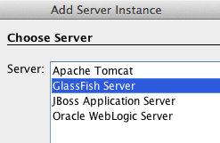

== Conclusion

This hands-on lab built a trivial 3-tier web application using Java EE 7
and demonstrated the following features of the platform:

* Java EE 7 Platform (JSR 342)
** Maven coordinates
** Default DataSource
** Default JMSConnectionFactory
* Java Persistence API 2.1 (JSR 338)
** Schema generation properties
* Java API for RESTful Web Services 2.0 (JSR 339)
** Client API
** Custom Entity Providers
* Java Message Service 2.0 (JSR 343)
** Default ConnectionFactory
** Injecting JMSContext
** Synchronous message send and receive
* JavaServer Faces 2.2 (JSR 344)

** Faces Flow
* Contexts and Dependency Injection 1.1 (JSR 346)
** Automatic discovery of beans
** Injection of beans
* Bean Validation 1.1 (JSR 349)
** Integration with JavaServer Faces
* Batch Applications for the Java Platform 1.0 (JSR 352)
** Chunk-style processing
** Exception handling
* Java API for JSON Processing 1.0 (JSR 353)
** Streaming API for generating JSON
** Streaming API for consuming JSON
* Java API for WebSocket 1.0 (JSR 356)
** Annotated server endpoint
** JavaScript client
* Java Transaction API 1.2 (JSR 907)
** @Transactional

 +

Hopefully this has raised your interest enough in trying out Java EE
7 applications using GlassFish 4.

Send us feedback at users@glassfish.java.net.

