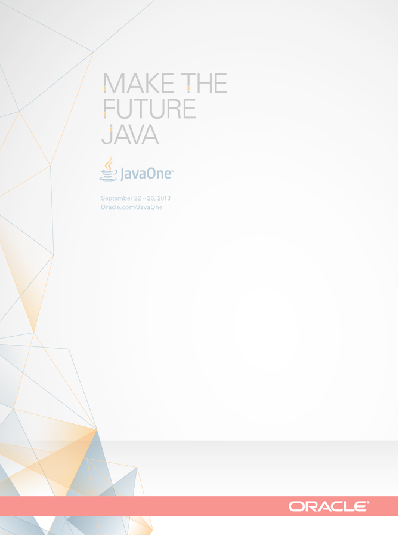
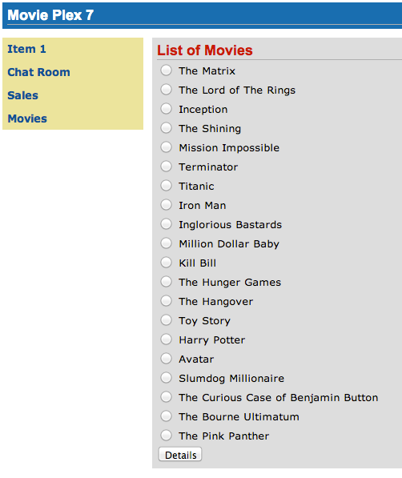
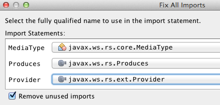
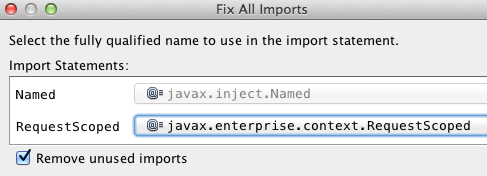
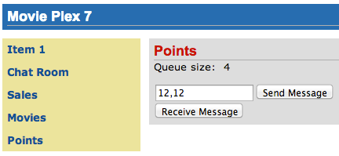
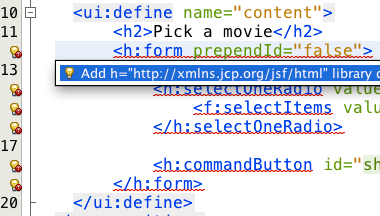
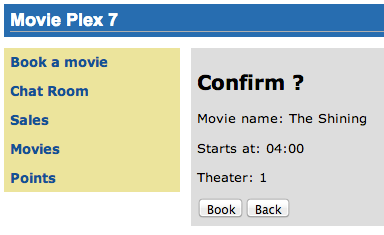

Java EE 7 Hands-on Lab
using GlassFish 4

*Java EE 7 Hands-on Lab*

 +

 +

Arun Gupta (Oracle)

Java EE & GlassFish Guy, @arungupta

 +

Antonio Goncalves (Independent)

Java EE EG Member, Consultant, Java Champion, @agoncal

 +

David Delabassee (Oracle)

GlassFish Product Manager, @delabassee

 +

Marian Muller (Serli)

Software Engineer, @mullermarian

image:be841a67.png[image] +

 +

 +

 +

 +

 +

 +

 +

 +

 +

*Table of Contents*

link:#__RefHeading__2_1146780383[1.0 Introduction 4]

link:#__RefHeading__4_1146780383[1.1 Software Requirement 4]

link:#__RefHeading__6_1146780383[2.0 Problem Statement 5]

link:#__RefHeading__8_1146780383[2.1 Lab Flow 7]

link:#__RefHeading__10_1146780383[2.2 Estimated Time 9]

link:#__RefHeading__12_1146780383[3.0 Walk-through of Sample Application
10]

link:#__RefHeading__14_1146780383[4.0 Chat Room (Java API for WebSocket)
17]

link:#__RefHeading__16_1146780383[5.0 Ticket Sales (Batch Applications
for the Java Platform) 26]

link:#__RefHeading__18_1146780383[6.0 View and Delete Movie (Java API
for RESTful Web Services) 35]

link:#__RefHeading__20_1146780383[7.0 Add Movie (Java API for JSON
Processing) 43]

link:#__RefHeading__22_1146780383[8.0 Movie Points (Java Message
Service) 52]

link:#__RefHeading__24_1146780383[9.0 Show Booking (JavaServer Faces)
60]

link:#__RefHeading__26_1146780383[10.0 Conclusion 70]

link:#__RefHeading__28_1146780383[11.0 Troubleshooting 71]

link:#__RefHeading__30_1146780383[12.0 Acknowledgements 72]

link:#__RefHeading__32_1146780383[13.0 Completed Solutions 72]

link:#__RefHeading__34_1146780383[13.1 TODO 72]

link:#__RefHeading__36_1146780383[13.2 Revision History 73]

link:#__RefHeading__38_1146780383[Appendix 73]

link:#__RefHeading__40_1146780383[Appendix A: Configure GlassFish 4 in
NetBeans IDE 73]

 +

 +

 +

*1.0 Introduction*

 +

The Java EE 7 platform continues the ease of development push that
characterized prior releases by bringing further simplification to
enterprise development. It adds new and important APIs such as the REST
client API in JAX-RS 2.0 and the long awaited Batch Processing API. Java
Message Service 2.0 has undergone an extreme makeover to align with the
improvements in the Java language. There are plenty of improvements to
several other components. Newer web standards like HTML 5, WebSocket,
and JSON processing are embraced to build modern web applications.

 +

This hands-on lab will build a typical 3-tier end-to-end application
using the following Java EE 7 technologies:

 +

* Java Persistence API 2.1 (JSR 338)
* Java API for RESTful Web Services 2.0 (JSR 339)
* Java Message Service 2.0 (JSR 343)
* JavaServer Faces 2.2 (JSR 344)
* Contexts and Dependency Injection 1.1 (JSR 346)
* Bean Validation 1.1 (JSR 349)
* Batch Applications for the Java Platform 1.0 (JSR 352)
* Java API for JSON Processing 1.0 (JSR 353)
* Java API for WebSocket 1.0 (JSR 356)
* Java Transaction API 1.2 (JSR 907)

 +

Together these APIs will allow you
timage:df8fc7a1.gif[image]o
be more productive by simplifying enterprise development.

 +

The latest version of this document can be downloaded from
http://glassfish.org/hol/javaee7-hol.pdf[glassfish.org/hol/javaee7-hol.pdf].

 +

[[]]
1.1 Software Requirement
~~~~~~~~~~~~~~~~~~~~~~~~

 +

The following software needs to be downloaded and installed:

 +

* JDK 7 from
http://www.oracle.com/technetwork/java/javase/downloads/index.html[http://www.oracle.com/technetwork/java/javase/downloads/index.html].
* NetBeans 7.4 or higher “All” or “Java EE” version from
http://netbeans.org/downloads/[http://netbeans.org/downloads/]. A
preview of the downloads page is shown and highlights the exact
“Download” button to be clicked.

 +

image:javaee7-hol%202_html_5900738f.png[image]

* GlassFish 4 comes pre-bundled with NetBeans 7.4+ and does not need to
be downloaded explicitly. But if you want to download GlassFish 4 then
can do so from http://glassfish.org/[glassfish.org].

 +

If you have downloaded GlassFish 4 separately or using a pre-installed
version of GlassFish 4, then configure it in NetBeans IDE following the
instructions in link:#AppendixA[Appendix A].

 +

 +

 +

 +

*2.0 Problem Statement*

 +

This hands-on lab builds a typical 3-tier Java EE 7 Web application that
allows customers to view the show timings for a movie in a 7-theater
Cineplex and make reservations. Users can add new movies and delete
existing movies. Customers can discuss the movie in a chat room. Total
sales from each showing are calculated at the end of the day. Customers
also accrue points for watching movies.

image:javaee7-hol%202_html_1b319c06.png[image]

 +

This figure shows the key components of the application. The User
Interface initiates all the flows in the application. Show Booking,
Add/Delete Movie and Ticket Sales interact with the database; Movie
Points may interact with the database, however, this is out of scope for
this application; and Chat Room does not interact with the database.

 +

The different functions of the application, as detailed above, utilize
various Java technologies and web standards in their implementation. The
following figure shows how Java EE technologies are used in different
flows.

 +

image:javaee7-hol%202_html_9f52a305.png[image]

The table below details the components and the selected technology used
in its’ implementation.

 +
 +

*Flow*

*Description*

User Interface

Written entirely in _JavaServer Faces_ (JSF).

Chat Room

Utilizes client-side JavaScript and JSON to communicate with a
_WebSocket_ endpoint

Ticket Sales

Uses _Batch Applications for the Java Platform_ to calculate the total
sales and persist to the database.

Add/Delete Movie

Implemented using RESTful Web Services. JSON is used as on-the-wire data
format.

Movie Points

Uses _Java Message Service_ (JMS) to update and obtain loyalty reward
points; an optional implementation using database technology may be
performed.

Show Booking

Uses lightweight _Enterprise JavaBeans_ to communicate with the database
using Java Persistence API.

 +
 +

 +

This document is not a comprehensive tutorial of Java EE. The attendees
are expected to know the basic Java EE concepts such as EJB, JPA,
JAX-RS, and CDI. The http://docs.oracle.com/javaee/7/tutorial/doc/[Java
EE 7 Tutorial] is a good place to learn all these concepts. However
enough explanation is provided in this guide to get you started with the
application.

 +

*WARNING*: This is a sample application and the code may not be
following the best practices to prevent SQL injection, cross-side
scripting attacks, escaping parameters, and other similar features
expected of a robust enterprise application. This is intentional such as
to stay focused on explaining the technology. It is highly recommended
to make sure that the code copied from this sample application is
updated to meet those requirements.

 +
 +

[[]]
2.1 Lab Flow
~~~~~~~~~~~~

 +

The attendees will start with an existing maven application and by
following the instructions and guidance provided by this lab they will:

 +

* Read existing source code to gain an understanding of the structure of
the application and use of the selected platform technologies.
* Add new and update existing code with provided fragments in order to
demonstrate usage of different technology stacks in the Java EE 7
platform.

 +

While you are copy/pasting the code from this document into NetBeans,
here are couple of tips that will be really useful and make your
experience enjoyable!

 +

* NetBeans provides capability to neatly format the source code
following conventions. This can be done for any type of source code,
whether its XML or Java or something else. It is highly recommended to
use this functionality after the code is copy/pasted from this document
to the editor. This keeps the code legible.

 +

This functionality can be accessed by right-clicking in the editor pane
and selecting “Format” as shown.

 +

image:javaee7-hol%202_html_ddb270c3.png[image]

 +

This functionality is also accessible using the following keyboard
shortcuts:

 +

*Shortcut*

*Operating System*

Ctrl + Shift + F

Mac

Alt + Shift + F

Windows

Alt + Shift + F

Linux

*

 +

* Copy/pasting the Java code from this document in NetBeans editor does
not auto-import the classes. This is required to be done manually in
order for the classes to compile. This can be fixed for each missing
import statement by clicking on the yellow bulb shown in the side bar.

 +

image:javaee7-hol%202_html_50b1b718.png[image]

 +

Alternatively all the imports can be resolved by right-clicking on the
editor pane and selecting "Fix Imports" as shown.

 +

image:javaee7-hol%202_html_77c15c51.png[image]

This functionality is also accessible using the following keyboard
shortcuts:

 +

*Shortcut*

*Operating System*

Command + Shift + I

Mac

Ctrl + Shift + I

Windows

Ctrl + Shift + I

Linux

*

 +

The defaults may work in most of the cases. Choices are shown in case a
class is available to import from multiple packages. If multiple
packages are available then specific packages to import from are clearly
marked in the document.

 +
 +

 +
 +

[[]]
2.2 Estimated Time
~~~~~~~~~~~~~~~~~~

 +

Following the complete instructions in this document can take any where
from three to five hours. The wide time range accommodates for learning
the new technologies, finding your way in NetBeans, copy/pasting the
code, and debugging the errors.

 +

The recommended flow is where you follow through the instructions in all
sections in the listed sequence. Alternatively, you may like to cover
section 4.0 through 9.0 in an order of your choice, based upon your
interest and preference of the technology. However section 6.0 is a
pre-requisite for section 7.0.

 +

Here is an approximate time estimate for each section:

 +

*Section Number and Title*

*Estimated Time*

3.0 Walk-through of Sample Application

15 - 30 mins

4.0 Chat Room (Java API for WebSocket)

30 - 45 mins

5.0 Ticket Sales (Batch Applications for the Java Platform)

30 - 45 mins

6.0 View and Delete Movie (Java API for RESTful Web Services)

30 - 45 mins

7.0 Add Movie (Java API for JSON Processing)

30 - 45 mins

8.0 Movie Points (Java Message Service)

30 - 45 mins

9.0 Show Booking (JavaServer Faces)

30 - 45 mins

 +

 +

The listed time for each section is only an estimate and by no means
restrict you within that. These sections have been completed in much
shorter time, and you can do it too!

 +

The listed time for each section also allows you to create a custom
version of the lab depending upon your target audience and available
time.

 +
 +

*3.0 Walk-through of Sample Application*

 +

 +

*Purpose*: This section will download the sample application to be used
in this hands-on lab. A walk-through of the application will be
performed to provide an understanding of the application architecture.

 +

*Estimated Time*: 15-30 mins

 +

 +

*3.1* Download the sample application from
http://glassfish.org/hol/movieplex7-starting-template.zip[glassfish.org/hol/movieplex7-starting-template.zip]
and unzip. This will create a “movieplex7” directory and unzips all the
content there.

 +

 +

*3.2* In NetBeans IDE, select “File”, “Open Project…”, select the
unzipped directory, and click on “Open Project”. The project structure
is shown.

 +

image:javaee7-hol%202_html_1facf390.png[image] +
 +

 +

image:javaee7-hol%202_html_7f86b25a.png[image] +

 +

*3.3* Maven Coordinates: Expand “Project Files” and double click on
“pom.xml”. In the “pom.xml”, the Java EE 7 API is specified as a
<dependency>:

 +

 +

<dependencies>

<dependency>

<groupId>javax</groupId>

<artifactId>javaee-api</artifactId>

<version>7.0</version>

<scope>provided</scope>

</dependency>

</dependencies>

 +

 +

This will ensure that Java EE 7 APIs are retrieved from the central
Maven repository.

 +

The Java EE 6 platform introduced the notion of “profiles”. A profile is
a configuration of the Java EE platform targeted at a specific class of
applications. All Java EE profiles share a set of common features, such
as naming and resource injection, packaging rules, security
requirements, etc. A profile may contain a proper subset or superset of
the technologies contained in the platform.

The Java EE Web Profile is a profile of the Java EE Platform
specifically targeted at modern web applications. The complete set of
specifications defined in the Web Profile is defined in the Java EE 7
Web Profile Specification. GlassFish can be downloaded in two different
flavors – Full Platform or Web Profile.

This lab requires Full Platform download. All technologies used in this
lab, except Java Message Service and Batch Applications for the Java
Platform, can be deployed on Web Profile.

 +

 +

*3.4* *Default Data Source*: Expand “Other Sources”,
“src/main/resources”, “META-INF”, and double-click on “persistence.xml”.
By default, NetBeans opens the file in Design View. Click on Source tab
to view the XML source.

 +

It looks like:

 +

<?xml version="1.0" encoding="UTF-8"?>

<persistence version="2.1"
xmlns="http://xmlns.jcp.org/xml/ns/persistence"
xmlns:xsi="http://www.w3.org/2001/XMLSchema-instance"
xsi:schemaLocation="http://xmlns.jcp.org/xml/ns/persistence
http://xmlns.jcp.org/xml/ns/persistence/persistence_2_1.xsd">

<persistence-unit name="movieplex7PU" transaction-type="JTA">

<!--

<jta-data-source>java:comp/DefaultDataSource</jta-data-source>

-->

<properties>

<property

name="javax.persistence.schema-generation.database.action"

value="drop-and-create"/>

<property

name="javax.persistence.schema-generation.create-source"

value="script"/>

<property

name="javax.persistence.schema-generation.drop-source"

value="script"/>

<property

name="javax.persistence.schema-generation.drop-script-source"

value="META-INF/drop.sql"/>

<property

name="javax.persistence.sql-load-script-source"

value="META-INF/load.sql"/>

<property

name="eclipselink.deploy-on-startup"

value="true"/>

<property

name="eclipselink.logging.exceptions"

value="false"/>

</properties>

</persistence-unit>

</persistence>

 +

Notice <jta-data-source> is commented out, i.e. no data source element
is specified. This element identifies the JDBC resource to connect to in
the runtime environment of the underlying application server.

 +

The Java EE 7 platform defines a new default DataSource that must be
provided by the runtime. This pre-configured data source is accessible
under the JNDI name

 +

java:comp/DefaultDataSource

 +

The JPA 2.1 specification says if neither jta-data-source nor
non-jta-data-source elements are specified, the deployer must specify a
JTA data source or the default JTA data source must be provided by the
container.

 +

For GlassFish 4, the default data source is bound to the JDBC resource
jdbc/__default.

 +

Clicking back and forth between “Design” and “Source” view may prompt
the error shown below:

 +

image:javaee7-hol%202_html_1bad94b0.png[image]

 +

This will get resolved when we run the application. Click on “OK” to
dismiss the dialog.

 +

 +

*3.5* *Schema Generation:*JPA 2.1 defines a new set of
javax.persistence.schema-generation.* properties that can be used to
generate database artifacts like tables, indexes, and constraints in a
database schema. This helps in prototyping of your application where the
required artifacts are generated either prior to application deployment
or as part of EntityManagerFactory creation. This feature will allow
your JPA domain object model to be directly generated in a database. The
generated schema may need to be tuned for actual production environment.

 +

The “persistence.xml” in the application has the following
javax.persistence.schema-generation.* properties. Their meaning and
possible values are explained in link:#Table2[Table 2].

 +

*Property*

*Meaning*

*Values*

javax.persistence.schema-generation.database.action

Specifies the action to be taken by the persistence provider with regard
to the database artifacts.

“none”, “create”, “drop-and-create”, “drop”

javax.persistence.schema-generation.create-source/drop-source

Specifies whether the creation or deletion of database artifacts is to
occur on the basis of the object/relational mapping metadata, DDL
script, or a combination of the two.

“metadata”, “script”, “metadata-then-script”, “script-then-metadata”

javax.persistence.schema-generation.create-script-source/drop-script-source

Specifies a java.IO.Reader configured for reading of the SQL script or a
string designating a file URL for the SQL script to create or delete
database artifacts.

 +

javax.persistence.sql-load-script-source

Specifies a java.IO.Reader configured for reading of the SQL load script
for database initialization or a string designating a file URL for the
script.

 +

 +

 +
 +

Refer to the http://jcp.org/en/jsr/detail?id=338[JPA 2.1 Specification]
for a complete understanding of these properties.

 +

In the application, the scripts are bundled in the WAR file in
“META-INF” directory. As the location of these scripts is specified as a
URL, the scripts may be loaded from outside the WAR file as well.

 +

Feel free to open “create.sql”, “drop.sql” and “load.sql” and read
through the SQL scripts. The database schema is shown.

 +

image:javaee7-hol%202_html_4aafed40.png[image]

 +

This folder also contains “sales.csv” which carries some comma-separated
data, and is used later in the application.

 +

 +

*3.6* *JPA entities, Stateless EJBs, and REST endpoints*: Expand “Source
Packages”. The package “org.glassfish.movieplex7.entities” contains the
JPA entities corresponding to the database table definitions. Each JPA
entity has several convenient @NamedQuery defined and uses Bean
Validation constraints to enforce validation.

 +

The package “org.glassfish.movieplex7.rest” contains stateless EJBs
corresponding to different JPA entities.

 +

Each EJB has methods to perform CRUD operations on the JPA entity and
convenience query methods. Each EJB is also EL-injectable (@Named) and
published as a REST endpoint (@Path). The AplicationConfig class defines
the base path of REST endpoint. The path for the REST endpoint is the
same as the JPA entity class name.

 +

The mapping between JPA entity classes, EJB classes, and the URI of the
corresponding REST
endimage:javaee7-hol%202_html_4d2c4337.png[image]point is shown.

 +

*JPA Entity Class*

*EJB Class*

*RESTful Path*

Movie

MovieFacadeREST

/webresources/movie

Sales

SalesFacadeREST

/webresources/sales

ShowTiming

ShowTimingFacadeREST

/webresources/showtiming

Theater

TheaterFacadeREST

/webresources/theater

Timeslot

TimeslotFacadeREST

/webresources/timeslot

 +

 +
 +

Feel free to browse through the code.

 +

 +

*3.7* *JSF pages*: “WEB-INF/template.xhtml” defines the template of the
web page and has a header, left navigation bar, and a main content
section. “index.xhtml” uses this template and the EJBs to display the
number of movies and theaters.

 +

Java EE 7 enables CDI discovery of beans by default. No “beans.xml” is
required in “WEB-INF”. This allows all beans with bean defining
annotation, i.e. either a bean with an explicit CDI scope or EJBs to be
available for injection.

 +

Note, “template.xhtml” is in “WEB-INF” folder as it allows the template
to be accessible from the pages bundled with the application only. If it
were bundled with rest of the pages then it would be accessible outside
the application and thus allowing other external pages to use it as
well.

 +

 +

*3.8* *Run the sample*: Right-click on the project and select “Run”.
This will download all the maven dependencies on your machine, build a
WAR file, deploy on GlassFish 4, and show the URL
http://localhost:8080/movieplex7[localhost:8080/movieplex7] in the
default browser configured in NetBeans. Note that this could take a
while if you have never built a Maven application on your machine. Also,
the project will show red squiggly lines in the source code indicating
that the classes cannot be resolved. This is expected before the
dependencies are downloaded. However these references will be resolved
correctly after the dependencies are downloaded during project building.

 +

During the first run, the IDE will ask you to select a deployment
server. Choose the configured GlassFish server and click on “OK”.

 +

 +

The output looks like as shown.

 +

image:javaee7-hol%202_html_ef6e216c.png[image]

 +

*4.0 Chat Room (Java API for WebSocket)*

 +

*Purpose*: Build a chat room for viewers. In doing so several new
features of Java API for WebSocket 1.0 will be introduced and
demonstrated by using them in the application.

 +

*Estimated Time*: 30-45 mins

 +

WebSocket provide a full-duplex and bi-directional communication
protocol over a single TCP connection. WebSocket is a combination of
http://tools.ietf.org/html/rfc6455[IETF RFC 6455]
http://tools.ietf.org/html/rfc6455[Protocol] and
http://www.w3.org/TR/websockets/[W3C JavaScript WebSocket API] (a
Candidate Recommendation as of this writing). The protocol defines an
opening handshake and data transfer. The API enables Web pages to use
the WebSocket protocol for two-way communication with the remote host.

 +

http://jcp.org/en/jsr/detail?id=356[JSR 356] defines a standard API for
creating WebSocket applications in the Java EE 7 Platform. The JSR
provides support for:

 +

* Create WebSocket endpoint using annotations and interface
* Initiating and intercepting WebSocket events
* Creation and consumption of WebSocket text and binary messages
* Configuration and management of WebSocket sessions
* Integration with Java EE security model

 +

This section will build a chat room for movie viewers.

 +

*4.1* Right-click on “Source Packages”, select “New”, “Java Class…”.
Give the class name as “ChatServer”, package as
“org.glassfish.movieplex7.chat”, and click on “Finish”.

 +

 +

*4.2* Change the class such that it looks like:

 +

@ServerEndpoint("/websocket")

public class ChatServer \{

 +

private static final Set<Session> peers =
Collections.synchronizedSet(new HashSet<Session>());

 +

@OnOpen

public void onOpen(Session peer) \{

peers.add(peer);

}

 +

@OnClose

public void onClose(Session peer) \{

peers.remove(peer);

}

 +

@OnMessage

public void message(String message, Session client) throws IOException,
EncodeException \{

for (Session peer : peers) \{

peer.getBasicRemote().sendObject(message);

}

}

}

 +

In this code:

* @ServerEndpoint decorates the class to be a WebSocket endpoint. The
value defines the URI where this endpoint is published.
* @OnOpen and @OnClose decorate the methods that must be called when
WebSocket session is opened or closed. The peer parameter defines the
client requesting connection initiation and termination.
* @OnMessage decorates the message that receives the incoming WebSocket
message. The first parameter, message, is the payload of the message.
The second parameter, client, defines the other end of the WebSocket
connection. The method implementation transmits the received message to
all clients connected to this endpoint.

 +

Resolve the imports by right-clicking in the editor and selecting “Fix
Imports” or (Command + Shift + I shortcut on Mac or Ctrl + Shift + I on
Windows).

 +

Make sure to pick java.websocket.Session for resolving imports.

 +

 +

image:javaee7-hol%202_html_63c71e43.png[image]

 +

Right-click again in the editor pane and select “Format” to format your
code.

 +

 +

*4.3* In “Web Pages”, select “New”, “Folder…”, give the folder name as
“chat” and click on “Finish”.

 +

 +

*4.4* Right-click on the newly created folder, select “New”, "Other...",
"Java Server Faces", “Facelets Template Client”, give the File Name as
“chatroom”. Click on “Browse…” next to “Template:”, expand “Web Pages”,
“WEB-INF”, select “template.xhtml”, and click on “Select File”. Click on
“Finish”.

 +

image:javaee7-hol%202_html_8574dd19.png[image]

 +

In this file, remove <ui:define> sections where name attribute value is
“top” and “left”. These sections are inherited from the template.

 +

Replace <ui:define> section with “content” name such that it looks like:

 +

<ui:define name="content">

<form action="">

<table>

<tr>

<td>

Chat Log 

<textarea readonly="true" rows="6" cols="50" id="chatlog"></textarea>

</td>

<td>

Users 

<textarea readonly="true" rows="6" cols="20" id="users"></textarea>

</td>

</tr>

<tr>

<td colspan="2">

<input id="textField" name="name" value="Duke" type="text"/>

<input onclick="join();" value="Join" type="button"/>

<input onclick="send_message();" value="Send" type="button"/>

<input onclick="disconnect();" value="Disconnect" type="button"/>

</td>

</tr>

</table>

</form>

</ui:define>

 +

The code builds an HTML form that has two textareas – one to display the
chat log and the other to display the list of users currently logged. A
single text box is used to take the user name or the chat message.
Clicking on “Join” button takes the value as user name and clicking on
“Send” takes the value as chat message. JavaScript methods are invoked
when these buttons are clicked and these are explained in the next
section. The chat messages are sent and received as WebSocket payloads.
There is an explicit button to disconnect the WebSocket connection.
“output” div is the placeholder for status messages. The WebSocket
initialization occurs in “websocket.js” included at the bottom of the
fragment.

 +

 +

*4.5* Right-click on “chat” in “Web Pages”, select “New”, "Other...",
“Web”, “JavaScript File”.

 +

Give the name as “websocket” and click on “Finish”.

 +

 +

*4.6* Edit the contents of “websocket.js” such that it looks like:

 +

 +

var wsUri = 'ws://' + document.location.host

+ document.location.pathname.substr(0,

document.location.pathname.indexOf("/faces"))

+ '/websocket';

console.log(wsUri);

var websocket = new WebSocket(wsUri);

var textField = document.getElementById("textField");

var users = document.getElementById("users");

var chatlog = document.getElementById("chatlog");

 +

var username;

websocket.onopen = function(evt) \{ onOpen(evt); };

websocket.onmessage = function(evt) \{ onMessage(evt); };

websocket.onerror = function(evt) \{ onError(evt); };

websocket.onclose = function(evt) \{ onClose(evt); };

var output = document.getElementById("output");

 +

function join() \{

username = textField.value;

websocket.send(username + " joined");

}

 +

function send_message() \{

websocket.send(username + ": " + textField.value);

}

 +

function onOpen() \{

writeToScreen("CONNECTED");

}

 +

function onClose() \{

writeToScreen("DISCONNECTED");

}

 +

function onMessage(evt) \{

writeToScreen("RECEIVED: " + evt.data);

if (evt.data.indexOf("joined") !== -1) \{

users.innerHTML += evt.data.substring(0, evt.data.indexOf(" joined")) +
"\n";

} else \{

chatlog.innerHTML += evt.data + "\n";

}

}

 +

function onError(evt) \{

writeToScreen('ERROR: ' + evt.data);

}

 +

function disconnect() \{

websocket.close();

}

 +

function writeToScreen(message) \{

var pre = document.createElement("p");

pre.style.wordWrap = "break-word";

pre.innerHTML = message;

output.appendChild(pre);

}

 +

 +

The WebSocket endpoint URI is calculated by using standard JavaScript
variables and appending the URI specified in the ChatServer class.
WebSocket is initialized by calling new WebSocket(…). Event handlers are
registered for lifecycle events using onXXX messages. The listeners
registered in this script are explained in the table.

 +

*Listeners*

*Called When*

onOpen(evt)

WebSocket connection is initiated

onMessage(evt)

WebSocket message is received

onError(evt)

Error occurs during the communication

onClose(evt)

WebSocket connection is terminated

 +

 +
 +

Any relevant data is passed along as parameter to the function. Each
method prints the status on the browser using writeToScreen utility
method. The join method sends a
mimage:javaee7-hol%202_html_a52b8bb1.png[image]essage to the endpoint
that a particular user has joined. The endpoint then broadcasts the
message to all the listening clients. The send_message method appends
the logged in user name and the value of the text field and broadcasts
to all the clients similarly. The onMessage method updates the list of
logged in users as well.

 +

 +

*4.7* Edit “WEB-INF/template.xhtml” and change:

 +

<h:outputLink value="item2.xhtml">Item 2</h:outputLink>

 +

to

 +

<h:outputLink
value="$\{facesContext.externalContext.requestContextPath}/faces/chat/chatroom.xhtml">Chat
Room</h:outputLink>

 +

The outputLink tag renders an HTML anchor tag with an href attribute.
$\{facesContext.externalContext.requestContextPath} provides the request
URI that identifies the web application context for this request. This
allows the links in the left navigation bar to be fully-qualified URLs.

 +

 +

*4.8* Run the project by right clicking on the project and selecting
“Run”. The browser shows
http://localhost:8080/movieplex7[localhost:8080/movieplex7].

 +

Click on “Chat Room” to see the output.

 +

The “CONNECTED” status message is shown and indicates that the WebSocket
connection with the endpoint is established.

 +

 +
 +

image:2174e272.png[image]

 +

 +

Please make sure your browser supports WebSocket in order for this page
to show up successfully. Chrome 14.0+, Firefox 11.0+, Safari 6.0+, and
IE 10.0+ are the browsers that support WebSocket. A complete list of
supported browsers is available at
http://caniuse.com/websockets[caniuse.com/websockets].

 +

Open the URI http://localhost:8080/movieplex7[localhost:8080/movieplex7]
in another browser window. Enter “Duke” in the text box in the first
browser and click “Join”.

 +

image:de9fa492.png[image]

 +

Notice that the user list and the status message in both the browsers
gets updated. Enter “James” in the text box of the second browser and
click on “Join”. Once again the user list and the status message in both
the browsers is updated. Now you can type any messages in any of the
browser and click on “Send” to send the message.

 +

The output from two different browsers after the initial greeting looks
like as shown.

 +

image:db88e0ea.png[image]

 +

 +

Here it shows output from Chrome on the top and Firefox on the bottom.

 +

Chrome Developer Tools or Firebug in Firefox can be used to monitor
WebSocket traffic.

 +

 +

 +

*5.0 Ticket Sales (Batch Applications for the Java Platform)*

 +

*Purpose*: Read the total sales for each show and populate the database.
In doing so several new features of Java API for Batch Processing 1.0
will be introduced and demonstrated by using them in the application.

 +

*Estimated Time*: 30-45 mins

 +

Batch Processing is execution of series of "jobs" that is suitable for
non-interactive, bulk-oriented and long-running tasks. Batch
Applications for the Java Platform (JSR 352) will define a programming
model for batch applications and a runtime for scheduling and executing
jobs.

 +

image:6c45bd3.png[image] +
 +

 +

The core concepts of Batch Processing are:

 +

* A *Job* is an instance that encapsulates an entire batch process. A
job is typically put together using a Job Specification Language and
consists of multiple steps. The Job Specification Language for JSR 352
is implemented with XML and is referred as "Job XML".
* A *Step* is a domain object that encapsulates an independent,
sequential phase of a job. A step contains all of the information
necessary to define and control the actual batch processing.
* *JobOperator* provides an interface to manage all aspects of job
processing, including operational commands, such as start, restart, and
stop, as well as job repository commands, such as retrieval of job and
step executions.
* *JobRepository* holds information about jobs current running and jobs
that run in the past. JobOperator provides access to this repository.
* Reader-Processor-Writer pattern is the primary pattern and is called
as *Chunk-oriented** **Processing*. In this, *ItemReader* reads one item
at a time, *ItemProcessor* processes the item based upon the business
logic, such as calculate account balance and hands it
to *ItemWriter* for aggregation. Once the 'chunk' numbers of items are
aggregated, they are written out, and the transaction is committed.

 +

This section will read the cumulative sales for each show from a CSV
file and populate them in a database.

 +

 +

*5.1* Right-click on Source Packages, select “New”, “Java Package…”,
specify the value as “org.glassfish.movieplex7.batch”, and click on
“Finish”.

 +

 +

*5.2* Right-click on newly created package, select “New”, “Java Class…”,
specify the name as “SalesReader”. Make this class extend from
AbstractItemReader, change the class definition and add:

 +

extends AbstractItemReader

 +

AbstractItemReader is an abstract class that implements ItemReader
interface. The ItemReader interface defines methods that read a stream
of items for chunk processing. This reader implementation returns a
String item type as indicated in the class definition.

 +

Add @Named as a class-level annotations and it allows the bean to be
injected in Job XML. Add @Dependent as another class-level annotation to
mark this bean as a bean defining annotation so that this bean is
available for injection.

 +

Resolve the imports.

 +

 +

*5.3* Add the following field:

 +

private BufferedReader reader;

 +

Override open() method to initialize the reader:

 +

public void open(Serializable checkpoint) throws Exception \{

reader = new BufferedReader(

new InputStreamReader(

Thread.currentThread()

.getContextClassLoader()

.getResourceAsStream("META-INF/sales.csv")));

}

 +

This method initializes a BufferedReader from “META-INF/sales.csv” that
is bundled with the application.

 +

 +

Sampling of the first few lines from “sales.csv” is shown below:

 +

1,500.00

2,660.00

3,80.00

4,470.00

5,1100.x0

 +

Each line has a show identifier comma separated by the total sales for
that show. Note that the last line (5^th^ record in the sample) has an
intentional typo. In addition, 17^th^ record also has an additional
typo. The lab will use these lines to demonstrate how to handle parsing
errors.

 +

 +

*5.4* Override the following method from the abstract class:

 +

@Override

public String readItem() \{

String string = null;

try \{

string = reader.readLine();

} catch (IOException ex) \{

ex.printStackTrace();

}

return string;

}

 +

The readItem method returns the next item from the stream. It returns
null to indicate end of stream. Note end of stream indicates end of
chunk, so the

current chunk will be committed and the step will end.

Resolve the imports.

 +
 +

*5.5* Right-click on “org.glassfish.movieplex7.batch” package, select
“New”, “Java Class…”, specify the name as “SalesProcessor”. Change the
class definition and add:

 +

implements ItemProcessor

 +

ItemProcessor is an interface that defines a method that is used to
operate on an input item and produce an output item. This processor
accepts a String input item from the reader, SalesReader in our case,
and returns a Sales instance to the writer (coming shortly). Sales is
the pre-packaged JPA entity with the application starter source code.

 +

Add @Named and @Dependent as class-level annotations so that it allows
the bean to be injected in Job XML.

 +

Resolve the imports.

 +

 +

*5.6* Add implementation of the abstract method from the interface as:

 +

@Override

public Sales processItem(Object s) \{

Sales sales = new Sales();

StringTokenizer tokens = new StringTokenizer((String)s, ",");

sales.setId(Integer.parseInt(tokens.nextToken()));

sales.setAmount(Float.parseFloat(tokens.nextToken()));

return sales;

}

 +

This method takes a String parameter coming from the SalesReader, parses
the value, populates them in the Sales instance, and returns it. This is
then aggregated with the writer.

 +

The method can return null indicating that the item should not be
aggregated. For example, the parsing errors can be handled within the
method and return null if the values are not correct. However this
method is implemented where any parsing errors are thrown as exception.
Job XML can be instructed to skip these exceptions and thus that
particular record is skipped from aggregation as well (shown later).

 +

Resolve the imports.

 +

 +

*5.7* Right-click on “org.glassfish.movieplex7.batch” package, select
“New”, “Java Class…”, specify the name as “SalesWriter”. Change the
class definition and add:

 +

extends AbstractItemWriter

 +

AbstractItemWriter is an abstract class that implements ItemWriter
interface. The ItemWriter interface defines methods that write to a
stream of items for chunk processing. This writer writes a list of Sales
items.

 +

Add @Named and @Dependent as class-level annotations so that it allows
the bean to be injected in Job XML.

 +

Resolve the imports.

 +

 +

*5.8* Inject EntityManager as:

 +

@PersistenceContext EntityManager em;

 +

Override the following method from the abstract class:

 +

@Override

@Transactional

public void writeItems(List list) \{

for (Sales s : (List<Sales>)list) \{

em.persist(s);

}

}

 +

Batch runtime aggregates the list of Sales instances returned from the
SalesProessor and makes it available as List in this method. This method
iterates over the list and persist each item in the database.

 +

The method also specifies @Transactional as a method level annotation.
This is a new annotation introduced by JTA 1.2 that provides the ability
to control transaction boundaries on CDI managed beans. This provides
the semantics of EJB transaction attributes in CDI beans without
dependencies such as RMI. This support is implemented via an
implementation of a CDI interceptor that conducts the necessary
suspending, resuming, etc. 

 +

In this case, a transaction is automatically started before the method
is called, committed if no checked exceptions are thrown, and rolled
back if runtime exceptions are thrown. This behavior can be overridden
using rollbackOn and dontRollbackOn attributes of the annotation.

 +

Resolve the imports.

 +

 +

*5.9* Create Job XML that defines the job, step, and chunk.

 +

In “Files” tab, expand the project -> “src” -> “main” -> “resources”,
right-click on “resources”, “META-INF”, select “New”, “Folder…”, specify
the name as “batch-jobs”, and click on “Finish”.

 +

Right-click on the newly created folder, select “New”, “Other…”, select
“XML”, “XML Document”, click on “Next >”, give the name as “eod-sales”,
click on “Next”, take the default, and click on “Finish”.

 +

Replace contents of the file with the following:

 +

<job id="endOfDaySales"
xmlns="http://xmlns.jcp.org/xml/ns/javaee[http://xmlns.jcp.org/xml/ns/javaee]"
version="1.0">

<step id="populateSales">

<chunk item-count="3" skip-limit="5">

<reader ref="salesReader"/>

<processor ref="salesProcessor"/>

<writer ref="salesWriter"/>

<skippable-exception-classes>

<include class="java.lang.NumberFormatException"/>

</skippable-exception-classes>

</chunk>

</step>

</job>

 +

 +

This code shows that the job has one step of chunk type. The <reader>,
<processor>, and <writer> elements define the CDI bean name of the
implementations of ItemReader, ItemProcessor, and ItemWriter interfaces.
The item-count attribute defines that 3 items are
read/processed/aggregated and then given to the writer. The entire
reader/processor/writer cycle is executed within a transaction. The
<skippable-exception-classes> element specifies a set of exceptions to
be skipped by chunk processing.

 +

CSV file used for this lab has intentionally introduced couple of typos
that would generate NumberFormatException. Specifying this element
allows skipping the exception, ignore that particular element, and
continue processing. If this element is not specified then the batch
processing will halt. The skip-limit attribute specifies the number of
exceptions a step will skip.

 +

*5.10* Lets invoke the batch job.

 +

Right-click on “org.glassfish.movieplex7.batch” package, select “New”,
“Java Class…”. Enter the name as “SalesBean” and click on “Finish”
button.

 +

Add the following code to the bean:

 +

public void runJob() \{

try \{

JobOperator jo = BatchRuntime.getJobOperator();

long jobId = jo.start("eod-sales", new Properties());

System.out.println("Started job: with id: " + jobId);

} catch (JobStartException ex) \{

ex.printStackTrace();

}

}

 +

This method uses BatchRuntime to get an instance of JobOperator, which
is then used to start the job. JobOperator is the interface for
operating on batch jobs. It can be used to start, stop, and restart
jobs. It can additionally inspect job history, to discover what jobs are
currently running and what jobs have previously run.

 +

Add @Named and @RequestScoped as class-level annotations. This allows
the bean to be injectable in an EL expression.

 +

Resolve the imports.

 +

image:367190ee.png[image]

 +

*5.11* Inject EntityManagerFactory in the class as:

 +

@PersistenceUnit EntityManagerFactory emf;

 +

and add the following method:

 +

public List<Sales> getSalesData() \{

return emf.createEntityManager().createNamedQuery("Sales.findAll",
Sales.class).getResultList();

}

 +

This method uses a pre-defined @NamedQuery to query the database and
return all the rows from the table.

 +

Resolve the imports.

 +

 +

*5.12* Right-click on “Web Pages”, select “New”, “Folder…”, specify the
name as “batch”, and click on “Finish”.

 +

Right-click on the newly created folder, select “New”, “Other…”,
“JavaServer Faces”, “Facelets Template Client”, and click on “Next >”.

 +

Give the File Name as “sales”. Click on “Browse…” next to “Template:”,
expand “Web Pages”, “WEB-INF”, select “template.xhtml”, and click on
“Select File”. Click on “Finish”.

 +

In this file, remove <ui:define> sections where name attribute value is
“top” and “left”. These sections are inherited from the template.

 +

Replace <ui:define> section with “content” name such that it looks like:

 +

 +

<ui:define name=”content”>

<h1>Movie Sales</h1>

<h:form>

<h:dataTable value="#\{salesBean.salesData}" var="s" border="1">

<h:column>

<f:facet name="header">

<h:outputText value="Show ID" />

</f:facet>

#\{s.id}

</h:column>

<h:column>

<f:facet name="header">

<h:outputText value="Sales" />

</f:facet>

#\{s.amount}

</h:column>

</h:dataTable>

 +

<h:commandButton value="Run Job" action="sales"
actionListener="#\{salesBean.runJob()}"/>

<h:commandButton value="Refresh" action="sales" />

</h:form>

</ui:define>

 +

This code displays the show identifier and sales from that show in a
table by invoking SalesBean.getSalesData(). First command button allows
invoking the job that processes the CSV file and populates the database.
The second command button refreshes the page.

 +

Right-click on the yellow bulb to fix namespace prefix/URI mapping. This
needs to be repeated for h: and f: prefix.

 +

 +

*5.13* Add the following code in “template.xhtml” along with other
<outputLink>s:

 +

<h:outputLink
value="$\{facesContext.externalContext.requestContextPath}/faces/batch/sales.xhtml">Sales</h:outputLink>

 +

 +

*5.14* Run the project to see the output as shown.

 +

image:67ec6198.png[image]

 +

Notice, a new “Sales” entry is displayed in the left navigation bar.

 +

 +

*5.15* Click on “Sales” to see the output as shown.

 +

image:f9b585c2.png[image]

 +

The empty table indicates that there is no sales data in the database.

 +

 +

*5.16* Click on “Run Job” button to initiate data processing of CSV
file. Look for “Waiting for localhost...” in the browser status bar,
wait for a couple of seconds for the processing to finish, and then
click on “Refresh” button to see the updated output as shown.

 +

image:81e229f6.png[image]

 +

 +

Now the table is populated with the sales data.

 +

Note that record 5 is missing from the table, as this records did not
have correct numeric entries for the sales total. The Job XML for the
application explicitly mentioned to skip such errors.

 +

 +

 +

*6.0 View and Delete Movie (Java API for RESTful Web Services)*

 +

*Purpose*: View, and delete a movie. In doing so several new features of
JAX-RS 2 will be introduced and demonstrated by using them in the
application.

 +

*Estimated Time*: 30-45 mins

 +

JAX-RS 2 defines a standard API to create, publish, and invoke a REST
endpoint. JAX-RS 2 adds several new features to the API:

* Client API that can be used to access Web resources and provides
integration with JAX-RS Providers. Without this API, the users need to
use a low-level HttpUrlConnection to access the REST endpoint.
* Asynchronous processing capabilities in Client and Server that enables
more scalable applications.
* Message Filters and Entity Interceptors as well-defined extension
points to extend the capabilities of an implementation.
* Validation constraints can be specified to validate the parameters and
return type.

This section will provide the ability to view all the movies, details of
a selected movie, and delete an existing movie using the JAX-RS Client
API.

*6.1* Right-click on “Source Packages”, select “New”, “Java Class…”.
Give the class name as “MovieClientBean”, package as
“org.glassfish.movieplex7.client”, and click on “Finish”.

 +

This bean will be used to invoke the REST endpoint.

 +

*6.2* Add @Named and @RequestScoped class-level annotations. This allows
the class to be injected in an EL expression and also defines the bean
to be automatically activated and passivated with the request.

 +

Resolve the imports. Make sure to pick
javax.enterprise.context.RequestScoped class.

 +

image:778b4c7c.png[image]

 +

 +

*6.3* Add the following code to the class:

 +

Client client;

WebTarget target;

 +

@PostConstruct

public void init() \{

client = ClientBuilder.newClient();

target =
client.target("http://localhost:8080/movieplex7/webresources/movie/");

}

 +

@PreDestroy

public void destroy() \{

client.close();

}

 +

ClientBuilder is the main entry point to the Client API. It uses a
fluent builder API to invoke REST endpoints. A new Client instance is
created using the default client builder implementation provided by the
JAX-RS implementation provider. Client are heavy-weight objects that
manage the client-side communication infrastructure. It is highly
recommended to create only required number of instances of Client and
close it appropriately.

 +

In this case, Client instance is created and destroyed in the lifecycle
callback methods. The endpoint URI is set on this instance by calling
the target method.

 +

 +

*6.4* Add the following method to the class:

 +

public Movie[] getMovies() \{

return target

.request()

.get(Movie[].class);

}

 +

A request is prepared by calling the request method. HTTP GET method is
invoked by calling get method. The response type is specified in the
last method call and so return value is of the type Movie[].

 +

 +

*6.5* Right-click on “Web Pages”, select “New”, “Folder…”, specify the
name as “client”, and click on “Finish”.

 +

Right-click on the newly created folder, select “New”, “Other…”,
“JavaServer Faces”, “Facelets Template Client”, and click on “Next >”.

 +

Give the File Name as “movies”. Click on “Browse…” next to “Template:”,
expand “Web Pages”, “WEB-INF”, select “template.xhtml”, and click on
“Select File”. Click on “Finish”.

 +

In this file, remove <ui:define> sections where name attribute value is
“top” and “left”. These sections are inherited from the template.

 +

*6.6* Replace the content inside <ui:define> with “content” with the
code fragment shown below:

 +

<h:form prependId="false">

<h:selectOneRadio value="#\{movieBackingBean.movieId}"
layout="pageDirection">

<c:forEach items="#\{movieClientBean.movies}" var="m">

<f:selectItem itemValue="#\{m.id}" itemLabel="#\{m.name}"/>

</c:forEach>

</h:selectOneRadio>

 +

<h:commandButton value="Details" action="movie" />

</h:form>

 +

This code fragment invokes getMovies method from MovieClientBean,
iterates over the response in a for loop, and display the name of each
movie with a radio button. The selected radio button value is bound to
the EL expression #\{movieBackingBean.movieId}.

 +

The code also has a button with “Details” label and looks for
“movie.xhtml” in the same directory. We will create this file later.

 +

Click on the yellow bulb in the left bar to resolve the namespace
prefix-to-URI resolution. This needs to be completed for – for h:, c:,
and f: prefixes.

 +

image:74a78a6d.png[image] +
 +

 +

 +

*6.7* Right-click on “org.glassfish.movieplex7.client” package, select
“New”, “Java Class…”, specify the value as “MovieBackingBean” and click
on “Finish”.

 +

Add the following field:

 +

int movieId;

 +

Add getters/setters by right-clicking on the editor pane and selecting
“Insert Code…” (Ctrl + I shortcut on Mac). Select the field and click on
“Generate”.

 +

Add @Named and @SessionScoped class-level annotations and implements
Serializable.

 +

Resolve the imports. Make sure to import
javax.enterprise.context.SessionScoped.

 +

 +

*6.8* In “template.xhtml”, add the following code in <ui:insert> with
name=”left”.

 +

<h:outputLink
value="$\{facesContext.externalContext.requestContextPath}/faces/client/movies.xhtml">Movies</h:outputLink>

 +

Running the project (Fn + F6 shortcut on Mac) and clicking on “Movies”
in the left navigation bar shows the output as shown.

 +

 +
 +

The list of all the movies with a radio button next to them is
displayed.

 +

 +

*6.9* In “MovieClientBean”, inject “MovieBackingBean” to read the value
of selected movie from the page. Add the following code:

 +

@Inject

MovieBackingBean bean;

 +

 +

 +

*6.10* In “MovieClientBean”, add the following method:

 +

public Movie getMovie() \{

Movie m = target

.path("\{movie}")

.resolveTemplate("movie", bean.getMovieId())

.request()

.get(Movie.class);

return m;

}

 +

This code reuses the Client and WebTarget instances created in
@PostConstruct. It also adds a variable part to the URI of the REST
endpoint, defined using \{movie}, and binds it to a concrete value using
resolveTemplate method. The return type is specified as a parameter to
the get method.

 +

 +

*6.11* Right-click on “client” folder, select “New”, “Facelets Template
Client”, give the File Name as “movie”. Click on “Browse…” next to
“Template:”, expand “Web Pages”, “WEB-INF”, select “template.xhtml”, and
click on “Select File”. Click on “Finish”.

 +

In this file, remove <ui:define> sections where name attribute value is
“top” and “left”. These sections are inherited from the template.

 +

Replace the content inside <ui:define> with “content” with the code
fragment shown below:

 +

 +

<h1>Movie Details</h1>

<h:form>

<table cellpadding="5" cellspacing="5">

<tr>

<th align="left">Movie Id:</th>

<td>#\{movieClientBean.movie.id}</td>

</tr>

<tr>

<th align="left">Movie Name:</th>

<td>#\{movieClientBean.movie.name}</td>

</tr>

<tr>

<th align="left">Movie Actors:</th>

<td>#\{movieClientBean.movie.actors}</td>

</tr>

</table>

<h:commandButton value="Back" action="movies" />

</h:form>

 +

Click on the yellow-bulb to resolve the namespace prefix-URI mapping for
h:. The output values are displayed by calling the getMovie method and
using the id, name, and actors property values.

 +

 +

*6.12* Run the project, select “Movies” in the left navigation bar,
select a radio button next to any movie, and click on details to see the
output as shown.

 +

image:2cea1ecd.png[image]

 +

 +

Click on the “Back” button to select another movie.

 +

 +

*6.13* Add the ability to delete a movie. In “movies.xhtml”, add the
following code with the other commandButton.

 +

<h:commandButton value="Delete" action="movies"
actionListener="#\{movieClientBean.deleteMovie()}"/>

 +

This button displays a label “Delete”, invokes the method deleteMovie
from “MovieClientBean”, and then renders “movies.xhtml”.

 +

 +

*6.14* Add the following code to “MovieClientBean”:

 +

public void deleteMovie() \{

target

.path("\{movieId}")

.resolveTemplate("movieId", bean.getMovieId())

.request()

.delete();

}

 +

This code again reuses the Client and WebTarget instances created in
@PostConstruct. It also adds a variable part to the URI of the REST
endpoint, defined using \{movieId}, and binds it to a concrete value
using resolveTemplate method. The URI of the resource to be deleted is
prepared and then delete method is called to delete the resource.

 +

Make sure to resolve the imports.

 +

Running the project shows the output shown.

 +

image:485d57a5.png[image] +
 +

Select a movie and click on Delete button. This deletes the movie from
the database and refreshes list on the page. Note that a redeploy of the
project will delete all the movies anyway and add them all back.

 +

 +

 +

*7.0 Add Movie (Java API for JSON Processing)*

 +

*Purpose*: Add a new movie. In doing so several new features of the Java
API for JSON Processing 1.0 will be introduced and demonstrated by using
them in the application.

 +

*Estimated Time*: 30-45 mins

 +

Java API for JSON Processing provides a standard API to parse and
generate JSON so that the applications can rely upon a portable API.
This API will provide:

 +

* Produce/Consume JSON in a streaming fashion (similar to StAX API for
XML)
* Build a Java Object Model for JSON (similar to DOM API for XML)

 +

This section will define a JAX-RS Entity Providers that will allow
reading and writing JSON for a Movie POJO. The JAX-RS Client API will
request this JSON representation.

 +

JAX-RS Entity Providers supply mapping services between on-the-wire
representations and their associated Java types.  Several standard Java
types such as String, byte[], javax.xml.bind.JAXBElement,
java.io.InputStream, java.io.File, and others have a pre-defined mapping
and is required by the specification. Applications may provide their own
mapping to custom types using MessageBodyReader and MessageBodyWriter
interfaces.

 +

This section will provide the ability to add a new movie to the
application. Typically, this functionality will be available after
proper authentication and authorization.

 +

*7.1* Right-click on Source Packages, select “New”, “Java Package…”,
specify the value as “org.glassfish.movieplex7.json”, and click on
“Finish”.

 +

 +

*7.2* Right-click on newly created package, select “New”, “Java Class…”,
specify the name as “MovieReader”, and click on “Finish”. Add the
following class-level annotations:

 +

@Provider

@Consumes(MediaType.APPLICATION_JSON)

 +

@Provider allows this implementation to be discovered by the JAX-RS
runtime during the provider scanning phase. @Consumes indicates that
this implementation will consume a JSON representation of the resource.

 +

Make sure to resolve imports from the appropriate package as shown.

 +

image:javaee7-hol%202_html_4b68287c.png[image] +
 +

 +

*7.3* Make the class implements MessageBodyReader<Movie>.

 +

image:a46c1db5.png[image]

 +

Click on the hint (shown as yellow bulb) on the class definition and
select “Implement all abstract methods”.

 +

 +

*7.4* Change implementation of the isReadable method as:

 +

return Movie.class.isAssignableFrom(type);

 +

This method ascertains if the MessageBodyReader can produce an instance
of a particular type.

 +

 +

*7.5* Replace the readFrom method to:

 +

@Override

public Movie readFrom(Class<Movie> type, Type type1, Annotation[] antns,
MediaType mt, MultivaluedMap<String, String> mm, InputStream in) throws
IOException, WebApplicationException \{

Movie movie = new Movie();

JsonParser parser = Json.createParser(in);

while (parser.hasNext()) \{

switch (parser.next()) \{

case KEY_NAME:

String key = parser.getString();

parser.next();

switch (key) \{

case "id":

movie.setId(parser.getInt());

break;

case "name":

movie.setName(parser.getString());

break;

case "actors":

movie.setActors(parser.getString());

break;

default:

break;

}

break;

default:

break;

}

}

return movie;

}

 +

This code reads a type from the input stream in. JsonParser, a streaming
parser, is created from the input stream. Key values are read from the
parser and a Movie instance is populated and returned.

 +

Resolve the imports.

 +

 +

*7.6* Right-click on newly created package, select “New”, “Java Class…”,
specify the name as “MovieWriter”, and click on “Finish”. Add the
following class-level annotations:

 +

@Provider

@Produces(MediaType.APPLICATION_JSON)

 +

@Provider allows this implementation to be discovered by the JAX-RS
runtime during the provider scanning phase. @Produces indicates that
this implementation will produce a JSON representation of the resource.

 +

Resolve the imports as shown.

 +

 +
 +

 +

*7.7* Make this class implements MessageBodyWriter<Movie>.

 +

image:1599de3.png[image]

 +

Click on the hint (show as yellow bulb) on the class definition and
select “Implement all abstract methods”.

 +

 +

*7.8* Change implementation of the isWritable method to:

 +

return Movie.class.isAssignableFrom(type);

 +

 +

This method ascertains if the MessageBodyWriter supports a particular
type.

 +

 +

*7.9* Add implementation of the getSize method as:

 +

 +

return -1;

 +

Originally, this method was called to ascertain the length in bytes of
the serialized form of t. In JAX-RS 2.0, this method is deprecated and
the value returned by the method is ignored by a JAX-RS runtime. All
MessageBodyWriter implementations are advised to return -1.

 +

 +

*7.10* Change implementation of the writeTo method as:

 +

public void writeTo(Movie t, Class<?> type, Type type1, Annotation[]
antns, MediaType mt, MultivaluedMap<String, Object> mm, OutputStream
out) throws IOException, WebApplicationException \{

JsonGenerator gen = Json.createGenerator(out);

gen.writeStartObject()

.write("id", t.getId())

.write("name", t.getName())

.write("actors", t.getActors())

.writeEnd();

gen.flush();

}

 +

This method writes a type to an HTTP message. JsonGenerator writes JSON
data to an output stream in a streaming way. Overloaded write methods
are used to write different data types to the stream.

 +

Resolve the imports.

 +

 +

*7.11* In “Web Pages”, right-click on “client” folder, select “New”,
“Facelets Template Client”.

 +

Give the File Name as “addmovie”. Click on “Browse…” next to
“Template:”, expand “Web Pages”, “WEB-INF”, select “template.xhtml”, and
click on “Select File”. Click on “Finish”.

 +

In this file, remove <ui:define> sections where name attribute value is
“top” and “left”. These sections are inherited from the template.

 +

Replace the content inside <ui:define> with “content” with the code
fragment shown below:

 +

 +

<h1>Add a New Movie</h1>

<h:form>

<table cellpadding="5" cellspacing="5">

<tr>

<th align="left">Movie Id:</th>

<td><h:inputText value="#\{movieBackingBean.movieId}"/></td>

</tr>

<tr>

<th align="left">Movie Name:</th>

<td><h:inputText value="#\{movieBackingBean.movieName}"/> </td>

</tr>

<tr>

<th align="left">Movie Actors:</th>

<td><h:inputText value="#\{movieBackingBean.actors}"/></td>

</tr>

 +

</table>

<h:commandButton value="Add" action="movies"

actionListener="#\{movieClientBean.addMovie()}"/>

</h:form>

 +

This code creates a form to accept input of id, name, and actors of a
movie. These values are bound to fields in “MovieBackingBean”. The click
of command button invokes the addMovie method from “MovieClientBean” and
then renders “movies.xhtml”.

 +

Click on the hint (show as yellow bulb) to resolve the namespace
prefix/URI mapping as shown.

 +

image:d2089e14.png[image]

 +

*7.12* Add movieName and actors field to “MovieBackingBean” as:

 +

String movieName;

String actors;

 +

Generate getters and setters by clicking on the menu item “Source” and
then “Insert Code...”.

 +

 +

*7.13* Add the following code to “movies.xhtml”

 +

<h:commandButton value="New Movie" action="addmovie" />

 +

along with rest of the <commandButton>s.

 +

 +

*7.14* Add the following method in “MovieClientBean”:

 +

public void addMovie() \{

Movie m = new Movie();

m.setId(bean.getMovieId());

m.setName(bean.getMovieName());

m.setActors(bean.getActors());

target

.register(MovieWriter.class)

.request()

.post(Entity.entity(m, MediaType.APPLICATION_JSON));

}

 +

This method creates a new Movie instance, populates it with the values
from the backing bean, and POSTs the bean to the REST endpoint. The
register method registers a MovieWriter that provides conversion from
the POJO to JSON. Media type of “application/json” is specified using
MediaType.APPLICATION_JSON.

 +

Resolve the imports as shown

 +

image:97086271.png[image]

 +

 +

*7.15* Run the project to see the updated main page as:

 +

image:25affc8f.png[image] +
 +

A new movie can be added by clicking on “New Movie” button.

 +

 +

*7.16* Enter the details as shown:

 +

image:3c303481.png[image] +
 +

 +

Click on “Add” button. The “Movie Id” value has to be greater than 20
otherwise the primary key constraint will be violated. The table
definition may be updated to generate the primary key based upon a
sequence; however this is not done in the application.

 +

The updated page looks like as shown

 +

image:67a043bb.png[image]

 +

Note that the newly added movie is now displayed.

 +

 +

*8.0 Movie Points (Java Message Service)*

 +

*Purpose*: Customers accrue points for watching a movie.

 +

*Estimated Time*: 30-45 mins

 +

Java Message Service 2.0 allows sending and receiving messages between
distributed systems. JMS 2 introduced several improvements over the
previous version such as:

 +

* New JMSContext interface
* AutoCloseable JMSContext, Connection, and Session
* Use of runtime exceptions
* Method chaining on JMSProducer
* Simplified message sending

 +

This section will provide a page to simulate submission of movie points
accrued by a customer. These points are submitted to a JMS queue that is
then read synchronously by another bean. JMS queue for further
processing, possibly storing in the database using JPA.

 +

*8.1* Right-click on Source Packages, select “New”, “Java Package…”,
specify the value as “org.glassfish.movieplex7.points”, and click on
“Finish”.

 +

 +

*8.2* Right-click on newly created package, select “New”, “Java Class…”,
specify the name as “SendPointsBean”.

 +

Add the following class-level annotations:

 +

@Named

@RequestScoped

 +

This makes the bean to be EL-injectable and automatically activated and
passivated with the request.

 +

Resolve the imports.

 +

 +

*8.3* A message to a JMS Queue is sent after the customer has bought the
tickets. Another bean will then retrieve this message and update the
points for that customer. This allows the two systems, one generating
the data about tickets purchased and the other about crediting the
account with the points, completely decoupled.

 +

This lab will mimic the sending and consuming of a message by an
explicit call to the bean from a JSF page.

 +

Add the following field to the class:

 +

@NotNull

@Pattern(regexp = "^\\d\{2},\\d\{2}",

message = "Message format must be 2 digits, comma, 2 digits, e.g.12,12")

private String message;

 +

This field contains the message sent to the queue. This field’s value is
bound to an inputText in a JSF page (created later). Constraints have
been specified on this bean that enable validation of data on form
submit. It requires the data to consists of 2 numerical digits, followed
by a comma, and then 2 more numerical digits. If the message does not
meet the validation criteria then the error message to be displayed is
specified using message attribute.

 +

This could be thought as conveying the customer identifier and the
points accrued by that customer.

 +

Generate getter/setters for this field. Right-click in the editor pane,
select “Insert Code” (Ctrl + I shortcut on Mac), select “Getter and
Setter…”, select the field, and click on “Generate”.

 +

 +

*8.4* Add the following code to the class:

 +

@Inject

JMSContext context;

@Resource(lookup = "java:global/jms/pointsQueue")

Queue pointsQueue;

 +

public void sendMessage() \{

System.out.println("Sending message: " + message);

 +

context.createProducer().send(pointsQueue, message);

}

 +

 +

The Java EE Platform requires a pre-configured JMS connection factory
under the JNDI name java:comp/DefaultJMSConnectionFactory. If no
connection factory is specified then the pre-configured connection
factory is used. In a Java EE environment, where CDI is enabled by
default anyway, a container-managed JMSContext can be injected as:

 +

@Inject

JMSContext context;

 +

This code uses the default factory to inject an instance of
container-managed JMSContext.

 +

JMSContext is a new interface introduced in JMS 2. This combines in a
single object the functionality of two separate objects from the JMS 1.1
API: a Connection and a Session.

 +

When an application needs to send messages it use the createProducer
method to create a JMSProducer that provides methods to configure and
send messages. Messages may be sent either synchronously or
asynchronously.

When an application needs to receive messages it uses one of several
createConsumer or createDurableConsumer methods to create a JMSConsumer.
A JMSConsumer provides methods to receive messages either synchronously
or asynchronously.

 +
 +

All messages are then sent to a Queue instance (created later)
identified by java:global/jms/pointsQueue JNDI name. The actual message
is obtained from the value entered in the JSF page and bound to the
message field.

Resolve the imports.

Make sure Queue class is imported from javax.jms.Queue instead of the
default java.util.Queue as shown.

 +

Click on “OK”.

 +

 +

*8.5* Right-click on “org.glassfish.movieplex7.points” package, select
“New”, “Java Class…”, specify the name as “ReceivePointsBean”.

 +

Add the following class-level annotations:

 +

@JMSDestinationDefinition(name = "java:global/jms/pointsQueue",

interfaceName = "javax.jms.Queue")

@Named

@RequestScoped

 +

This allows the bean to refered from an EL expression. It also activates
and passivates the bean with the request.

 +

JMSDestinationDefinition is a new annotation introduced in JMS 2. It is
used by the application to provision the required resources and allow an
application to be deployed into a Java EE environment with minimal
administrative configuration. This code will create Queue with the JNDI
name java:global/jms/pointsQueue.

 +

 +

*8.6* Add the following code to the class:

 +

 +

@Inject

JMSContext context;

@Resource(lookup="java:global/jms/pointsQueue")

Queue pointsQueue;

 +

public String receiveMessage() \{

String message =
context.createConsumer(pointsQueue).receiveBody(String.class);

System.out.println("Received message: " + message);

return message;

}

 +

This code is very similar to SendPointsBean. createConsumer method
creates JMSConsumer which is then used to synchronously receive a
message.

 +

 +

*8.7* Add the following method to the class:

 +

public int getQueueSize() \{

int count = 0;

try \{

QueueBrowser browser = context.createBrowser(pointsQueue);

Enumeration elems = browser.getEnumeration();

while (elems.hasMoreElements()) \{

elems.nextElement();

count++;

}

} catch (JMSException ex) \{

ex.printStackTrace();

}

return count;

}

 +

This code creates a QueueBrowser to look at the messages on a queue
without removing them. It calculates and returns the total number of
messages in the queue.

 +

Make sure to resolve the import from javax.jms.Queue, take all other
defaults.

 +

 +

*8.8* Right-click on “Web Pages”, select “New”, “Folder…”, specify the
name as “points”, and click on “Finish”.

 +

In “Web Pages”, right-click on newly created folder, select “Facelets
Template Client”, give the File Name as “points”. Click on “Browse…”
next to “Template:”, expand “Web Pages”, “WEB-INF”, select
“template.xhtml”, and click on “Select File”. Click on “Finish”.

 +

In this file, remove <ui:define> sections where name attribute value is
“top” and “left”. These sections are inherited from the template.

 +

Replace the content inside <ui:define> with “content” with the code
fragment shown below:

 +

Copy the following code inside <ui:define> with name=”content”:

 +

<h1>Points</h1>

<h:form>

Queue size:

<h:outputText value="#\{receivePointsBean.queueSize}"/>

<h:inputText value="#\{sendPointsBean.message}"/>

 +

<h:commandButton value="Send Message" action="points"
actionListener="#\{sendPointsBean.sendMessage()}"/>

</h:form>

<h:form>

<h:commandButton value="Receive Message" action="points"
actionListener="#\{receivePointsBean.receiveMessage()}"/>

</h:form>

 +

Click on the yellow bulb to resolve namespace prefix/URI mapping for h:
prefix.

 +

This page displays the number of messages in the current queue. It
provides a text box for entering the message that can be sent to the
queue. The first command button invokes sendMessage method from
SendPointsBean and refreshes the page. Updated queue count, incremented
by 1 in this case, is displayed. The second command button invokes
receiveMessage method from ReceivePointsBean and refreshes the page. The
queue count is updated again, decremented by 1 in this case.

 +

If the message does not meet the validation criteria then the error
message is displayed on the screen.

 +

 +

*8.9* Add the following code in “template.xhtml” along with other
<outputLink>s:

 +

<h:outputLink
value="$\{facesContext.externalContext.requestContextPath}/faces/points/points.xhtml">Points</h:outputLink>

 +

 +

*8.10* Run the project. The update page looks like as shown:

 +

image:ebf0adef.png[image]

 +

Click on “Points” to see the output as:

 +

image:5207ab50.png[image]

 +

The output shows that the queue has 0 messages. Enter a message “1212”
in the text box and click on “Send Message” to see the output as shown.

 +

image:2c518642.png[image]

 +

This message is not meeting the validation criteria and so the error
message is displayed.

 +

Enter a message as “12,12” in the text box and click on “Send Message”
button to see the output as:

 +

image:4a5be2ba.png[image]

The updated count now shows that there is 1 message in the queue. Click
on “Receive Message” button to see output as:

 +

image:f95c49ad.png[image]

 +

 +

The updated count now shows that the message has been consumed and the
queue has 0 messages.

 +

Click on “Send Message” 4 times to see the output as:

 +

The updated count now shows that the queue has 4 messages. Click on
“Receive Message” 2 times to see the output as:

 +

image:ab504531.png[image]

 +

The count is once again updated to reflect the 2 consumed and 2
remaining messages in the queue.

 +

 +

 +

*9.0 Show Booking (JavaServer Faces)*

 +

*Purpose*: Build pages that allow a user to book a particular movie show
in a theater. In doing so a new feature of JavaServer Faces 2.2 will be
introduced and demonstrated by using in the application.

 +

*Estimated Time*: 30-45 mins

 +

JavaServer Faces 2.2 introduces a new feature called _Faces Flow_ that
provides an encapsulation of related views/pages with application
defined entry and exit points. Faces Flow borrows core concepts from ADF
TaskFlow, Spring Web Flow, and Apache MyFaces CODI.

 +

It introduces @FlowScoped CDI annotation for flow-local storage and
@FlowDefinition to define the flow using CDI producer methods. There are
clearly defined entry and exit points with well-defined parameters. This
allows the flow to be packaged together as a JAR or ZIP file and be
reused. The application thus becomes a collection of flows and non-flow
pages. Usually the objects in a flow are designed to allow the user to
accomplish a task that requires input over a number of different views.

 +

This application will build a flow that allows the user to make a movie
reservation. The flow will contain four pages:

 +

1.  Display the list of movies
2.  Display the list of available show timings
3.  Confirm the choices
4.  Make the reservation and show the ticket

 +

 +
 +

*9.1* Items in a flow are logically related to each other and so it is
required to keep them together in a directory. In NetBeans, right-click
on the “Web Pages”, select “New”, “Folder…”, specify the folder name
“booking”, and click on “Finish”.

 +

 +

*9.2* Right-click on the newly created folder, select “New”, “Facelets
Template Client”, give the File Name as “booking”. Click on “Browse…”
next to “Template:”, expand “Web Pages”, “WEB-INF”, select
“template.xhtml”, and click on “Select File”. Click on “Finish”.

 +

 +

In this file, remove <ui:define> sections where name attribute value is
“top” and “left”. These sections are inherited from the template.

 +

 +

*9.3* “booking.xhtml” is the entry point to the flow (more on this
later). Replace the <ui:define> with name=”content” section such that it
looks like:

 +

<ui:define name="content">

<h2>Pick a movie</h2>

<h:form prependId="false">

 +

<h:selectOneRadio value="#\{booking.movieId}" layout="pageDirection"
required="true">

<f:selectItems value="#\{movieFacadeREST.all}" var="m"
itemValue="#\{m.id}" itemLabel="#\{m.name}"/>

</h:selectOneRadio>

<h:commandButton id="shows" value="Pick a time" action="showtimes" />

</h:form>

</ui:define>

 +

The code builds an HTML form that displays the list of movies as radio
button choices. The chosen movie is bound to #\{booking.movieId} which
will be defined as a flow-scoped bean. The value of action attribute on
commandButton refers to the next view in the flow, i.e.
“showtimes.xhtml” in the same directory in our case.

 +

Click on the hint (shown as yellow bulb) and click on the suggestion to
add namespace prefix. Do the same for f: prefix as shown.

 +

 +

 +

*9.4* Right-click on “Source Packages”, select “New”, “Java Class…”.
Specify the class name as “Booking” and the package name as
“org.glassfish.movieplex7.booking”.

 +

Add @Named class-level annotation to make the class EL-injectable. Add
@FlowScoped("booking") to define the scope of bean as the flow. The bean
is automatically activated and passivated as the flow is entered or
exited.

 +

Add the following field:

 +

int movieId;

 +

and generate getters/setters by going to “Source”, “Insert Code…”,
selecting “Getter and Setter…”, and select the field.

 +

Inject EntityManager in this class by adding the following code:

 +

@PersistenceContext

EntityManager em;

 +

Add the following convenience method:

 +

public String getMovieName() \{

try \{

return em.createNamedQuery("Movie.findById",
Movie.class).setParameter("id", movieId).getSingleResult().getName();

} catch (NoResultException e) \{

return "";

}

}

 +

This method will return the movie name based upon the selected movie.

 +

Alternatively, movie id and name may be passed from the selected radio
button and parsed in the backing bean. This will reduce an extra trip to
the database.

 +

 +

*9.5* Create “showtimes.xhtml” in the “booking” folder following the
steps in section 9.2. Replace “content” <ui:define> section such that it
looks like:

 +

<ui:define name="content">

<h2>Show Timings for #\{booking.movieName}</h2>

<h:form>

<h:selectOneRadio value="#\{booking.startTime}" layout="pageDirection"
required="true">

<c:forEach items="#\{timeslotFacadeREST.all}" var="s">

<f:selectItem itemValue="#\{s.id},#\{s.startTime}"
itemLabel="#\{s.startTime}"/>

</c:forEach>

</h:selectOneRadio>

<h:commandButton value="Confirm" action="confirm" />

<h:commandButton id="back" value="Back" action="booking"
immediate="true"/>

</h:form>

</ui:define>

 +

This code builds an HTML form that displays the chosen movie name and
all the show times. #\{timeslotFacadeREST.all} returns the list of all
the movies and iterates over them using a c:forEach loop. The id and
start time of the selected show are bound to #\{booking.startTime}. One
command button (value=”Back”) allows going back to the previous page and
the other command button (value=”Confirm”) takes to next view in the
flow, “confirm.xhtml” in our case.

 +

Typically a user will expect the show times only for the selected movie
but all the show times are shown here. This allows us to demonstrate
going back and forth within a flow if an incorrect show time for a movie
is chosen. A different query may be written that displays only the shows
available for this movie; however this is not part of the application.

 +

 +

*9.6* Add the following fields to the Booking class:

 +

String startTime;

int startTimeId;

 +

And the following methods:

 +

public String getStartTime() \{

return startTime;

}

 +

public void setStartTime(String startTime) \{

StringTokenizer tokens = new StringTokenizer(startTime, ",");

startTimeId = Integer.parseInt(tokens.nextToken());

this.startTime = tokens.nextToken();

}

 +

public int getStartTimeId() \{

return startTimeId;

}

 +

These methods will parse the values received from the form. Also add the
following method:

 +

public String getTheater() \{

// for a movie and show

try \{

// Always return the first theater

List<ShowTiming> list =

em.createNamedQuery("ShowTiming.findByMovieAndTimingId",

ShowTiming.class)

.setParameter("movieId", movieId)

.setParameter("timingId", startTimeId)

.getResultList();

if (list.isEmpty())

return "none";

 +

return list

.get(0)

.getTheaterId()

.getId().toString();

} catch (NoResultException e) \{

return "none";

}

}

 +

This method will find the first theater available for the chosen movie
and show the timing.

 +

Additionally a list of theaters offering that movie may be shown in a
separate page.

 +

 +

*9.7* Create “confirm.xhtml” page in the “booking” folder by following
the steps defined in 9.2. Replace “content” <ui:define> section such
that it looks like:

 +

<ui:define name="content">

<c:choose>

<c:when test="#\{booking.theater == 'none'}">

<h2>No theater found, choose a different time</h2>

<h:form>

Movie name: #\{booking.movieName}

Starts at: #\{booking.startTime}

<h:commandButton id="back" value="Back" action="showtimes"/>

</h:form>

</c:when>

<c:otherwise>

<h2>Confirm ?</h2>

<h:form>

Movie name: #\{booking.movieName}

Starts at: #\{booking.startTime}

Theater: #\{booking.theater}

<h:commandButton id="next" value="Book" action="print"/>

<h:commandButton id="back" value="Back" action="showtimes"/>

</h:form>

</c:otherwise>

</c:choose>

</ui:define>

 +

The code displays the selected movie, show timing, and theater if
available. The reservation can proceed if all three are available.
“print.xhtml”, identified by action of commandButton with “Book” value,
is the last page that shows the confirmed reservation.

 +

actionListener can be added to commandButton to invoke the business
logic for making the reservation. Additional pages may be added to take
the credit card details and email address.

 +

 +

*9.8* Create “print.xhtml” page in the “booking” folder by following the
steps defined in 9.2 and replace “content” <ui:define> section such that
it looks like:

 +

<ui:define name="content">

<h2>Reservation Confirmed</h2>

<h:form>

Movie name: #\{booking.movieName}

Starts at: #\{booking.startTime}

Theater: #\{booking.theater}

<h:commandButton id="home" value="home" action="goHome" />

</h:form>

</ui:define>

 +

This code displays the movie name, show timings, and the selected
theater.

 +

The commandButton initiates exit from the flow. The action attribute
defines a navigation rule that will be defined in the next step.

 +

 +

*9.9* “booking.xhtml”, “showtimes.xhtml”, “confirm.xhtml”, and
“print.xhtml” are all in the same directory. Now the runtime needs to be
informed that the views in this directory are to be treated as view
nodes in a flow. This can be done by adding “booking/booking-flow.xml”
or have a class with a method that @Produces @FlowDefinition.

 +

Right-click on “Web Pages/booking” folder, select “New”, “Other”, “XML”,
“XML Document”, give the name as “booking-flow”, click on “Next>”, take
the default of “Well-formed Document”, and click on “Finish”. Edit the
file such that it looks like:

 +

<faces-config version="2.2" xmlns="http://xmlns.jcp.org/xml/ns/javaee"

xmlns:xsi="http://www.w3.org/2001/XMLSchema-instance"

xsi:schemaLocation="

http://xmlns.jcp.org/xml/ns/javaee

http://xmlns.jcp.org/xml/ns/javaee/web-facesconfig_2_2.xsd">

<flow-definition id="booking">

<flow-return id="goHome">

<from-outcome>/index</from-outcome>

</flow-return>

</flow-definition>

</faces-config>

 +

This defines the flow graph. It uses the standard parent element used in
any “faces-config.xml” but defines a <flow-definition>.

 +

<flow-return> defines a return node in a flow graph. <from-outcome>
contains the node value, or an EL expression that defines the node, to
return to. In this case, the navigation returns to the home page.

 +

 +

*9.10* Finally, invoke the flow by editing “WEB-INF/template.xhtml” and
changing:

 +

<h:commandLink action="item1">Item 1</h:commandLink>

 +

to

 +

<h:commandLink action="booking">Book a movie</h:commandLink>

 +

commandLink renders an HTML anchor tag that behaves like a form submit
button. The action attribute points to the directory where all views for
the flow are stored. This directory already contains “booking-flow.xml”
which defines the flow of the pages.

 +

 +

*9.11* Run the project by right clicking on the project and selecting
“Run”. The browser shows the updated output.

 +

image:d4317123.png[image]

 +

Click on “Book a movie” to see the page as shown.

 +

image:3ab805a7.png[image]

 +

Select a movie, say “The Shining” and click on “Pick a time” to see the
page output as shown.

 +

 +

image:710cafd8.png[image]

 +

Pick a time slot, say “04:00”, click
oimage:293e7bcd.png[image]image:10d00070.gif[image]n
“Confirm” to see the output as shown.

 +

 +

Click on “Book” to confirm and see the output as:

 +

image:a9238694.png[image]

 +

Feel free to enter other combinations, go back and forth in the flow and
notice how the values in the bean are preserved.

 +

Click on “home” takes to the main application page.

 +

 +

 +

*10.0 Conclusion*

 +

 +

This hands-on lab built a trivial 3-tier web application using Java EE 7
and demonstrated the following features of the platform:

 +

* Java EE 7 Platform (JSR 342)
** Maven coordinates
** Default DataSource
** Default JMSConnectionFactory
* Java Persistence API 2.1 (JSR 338)
** Schema generation properties
* Java API for RESTful Web Services 2.0 (JSR 339)
** Client API
** Custom Entity Providers
* Java Message Service 2.0 (JSR 343)
** Default ConnectionFactory
** Injecting JMSContext
** Synchronous message send and receive
* JavaServer
Facesimage:faaa1f11.png[image]
2.2 (JSR 344)
** Faces Flow
* Contexts and Dependency Injection 1.1 (JSR 346)
** Automatic discovery of beans
** Injection of beans
* Bean Validation 1.1 (JSR 349)
** Integration with JavaServer Faces
* Batch Applications for the Java Platform 1.0 (JSR 352)
** Chunk-style processing
** Exception handling
* Java API for JSON Processing 1.0 (JSR 353)
** Streaming API for generating JSON
** Streaming API for consuming JSON
* Java API for WebSocket 1.0 (JSR 356)
** Annotated server endpoint
** JavaScript client
* Java Transaction API 1.2 (JSR 907)
** @Transactional

 +

 +

Hopefully this has raised your interest enough in trying out Java EE
7applications using GlassFish 4.

Send us feedback at users@glassfish.java.net.

 +

*11.0 Troubleshooting*

 +

 +

*11.1* How can I start/stop/restart GlassFish from within the IDE ?

 +
 +

In the “Services” tab, right-click on “GlassFish Server 4”. All the
commands to start, stop, and restart are available from the pop-up menu.
The server log can be viewed by clicking on “View Server Log” and
web-based administration console can be seen by clicking on “View Admin
Console”.

 +
 +

*11.2* I accidentally closed the GlassFish output log window. How do I
bring it back ?

In “Services” tab of NetBeans, expand “Servers”, choose the GlassFish
node, and select “View Domain Server Log”.

 +

 +

*12.0 Acknowledgements*

 +

 +

The following GlassFish community members graciously reviewed this
hands-on lab:

 +

* Antonio Goncalves (@agoncal)
* Markus Eisele (@myfear)
* Craig Sharpe (@dapugs)
* Marcus Vinicius Margarites (@mvfm)
* David Delabasse (@delabasse)
* John Clingan (@jclingan)
* Reza Rahman (@reza_rahman)

 +

Thank you very much for providing the valuable feedback!

 +

 +

*13.0 Completed Solutions*

 +

The completed solution can be downloaded from
http://glassfish.org/hol/movieplex7-solution.zip[glassfish.org/hol/movieplex7-solution.zip].

 +

 +

[[]]
13.1 TODO
~~~~~~~~~

 +

1.  Add the following use cases:
1.  Concurrency Utilities for Java EE
2.  WebSocket Java Client
3.  JAX-RS Logging Filter
2.  Disable errors in persistence.xml
3.  How to override .m2/repository in NetBeans?
4.  Add icons for Fix Imports, Format, Fix namespaces, Run the Project.
5.  Change logging to use java.util.Logging.

 +

 +

[[]]
13.2 Revision History
~~~~~~~~~~~~~~~~~~~~~

 +

1.  1.1:
1.  Moving the source document from Microsoft Word to Pages.
2.  Added time estimates for each section.
3.  Updated to use NetBeans 7.4 nightly.
4.  Reorganized to ensure that newer Java EE 7 technologies are
described first.
2.  1.0.4: Code updates from UberConf.
3.  1.0.3: Incorporating typos, missing dialog boxes, and code
optimizations received during DevoxxUK.
4.  1.0.2: Updating instructions after some of the bugs have been fixed.
5.  1.0.1: Using the final GlassFish 4 build (b89).

 +

 +

*Appendix*

 +

[[]]
Appendix A: Configure GlassFish 4 in NetBeans IDE
~~~~~~~~~~~~~~~~~~~~~~~~~~~~~~~~~~~~~~~~~~~~~~~~~

 +

A.1 In NetBeans, click on the “Services” tab.

image:d0442332.png[image] +
 +

A.2 Right-click on Servers, choose “Add Server...” in the pop-up menu.

A.3 Select “GlassFish Server” in the Add Server Instance wizard, set the
name to “GlassFish 4.0” and click “Next >”.

A.4 Click on “Browse …” and browse to where you unzipped the GlassFish
build and point to the “glassfish4” directory that got created when you
unzipped the above archive. Click on “Finish”.

 +

 +

